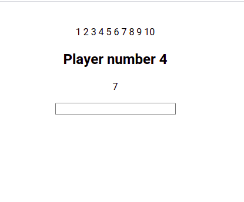

# GameJoy - Lets create a game that can spread joy!

## So what is a game? 

 here are some examples
- Letting a user guess a random number between 1-10
- A game where the more words you write the higher a score you get
- A game where you get a point for each second you press and hold space
- Maybe some of you could even make a multiplayer game!

  

